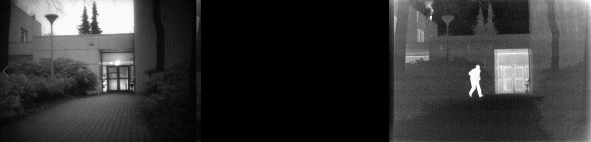
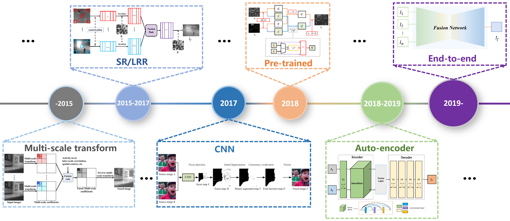
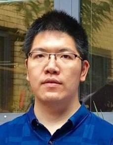
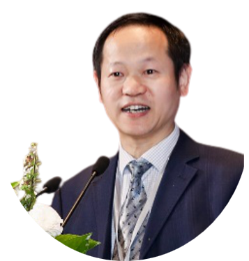
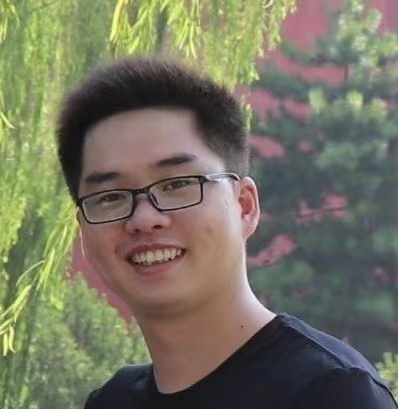
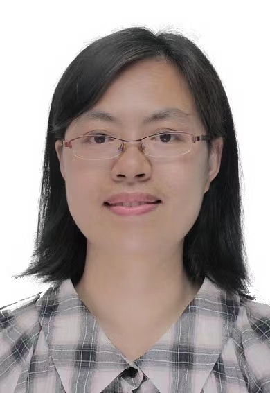

**Authors:** [Tianyang Xu][tianyang-xu], [Xiao-Jun Wu][xiao-jnu-wu], [Hui Li][hui-li], [Xiaoqing Luo][xiaoqing-luo], [Josef Kittler][josef-kittler]

# Schedule

Coming soon.

# 1. Introduction

Many pattern recognition tasks, whether carried out by humans or machines are facilitated by the use of multimodal sensing (e.g. RGB, infrared, thermal, depth, hyperspectral, LIDAR) which provides complementary information about the objects or phenomena to be classified by measuring their different properties. However, this raises the problem of fusing the multiple sources of information (views).  The problem has been addressed by research in image fusion. The aim of this tutorial is to provide  an overview of the visual information fusion area, covering: 
* (1) Problem formulation and prerequisites 
* (2) Visual fusion frameworks 
* (3) Image fusion techniques 

The use of the fusion techniques described will be illustrated on different  applications, including visual object tracking.

<table width="100%" cellpadding="0">
	<tbody>
		<tr width="100%">
			<td>
			
			</td>
			<td>
			
			</td>
		</tr>
		<tr width="100%">
			<td>
			
			</td>
			<td>
			
			</td>
		</tr>
	</tbody>
</table>

# 2. Topics covered

### 2.1 Visual fusion basics 
* (1) Introduction to the image fusion problem.
* (2) The problem formulation and terminology. 
* (3) The basic principles of visual fusion.
* (4) An overview of the visual fusion system architecture.
* (5) Prerequisites: image decomposition and autoencoder.

### 2.2 Visual fusion frameworks

* (1) Visual fusion frameworks: data-level fusion, feature-level fusion and decision-level fusion.
* (2) Data fusion mechanisms and models.
* (3) Performance evaluation: subjective and objective metrics. 

### 2.3 Image fusion techniques

* (1) Classical fusion methods
* (2) Deep representation methods
	* (a) Pre-trained network approaches
	* (b) Auto-encoders
	* (c) End-to-end fusion networks

### 2.4 Visual fusion applications

* (1) Visible and thermal data fusion for RGB-T tracking.
<table width="60%" cellpadding="0">
	<tbody>
		<tr width="100%">
			<td>
			
			</td>
		</tr>
	</tbody>
</table>

* (2) Visible and depth data fusion for RGB-D tracking.
<table width="60%" cellpadding="0">
	<tbody>
		<tr width="100%">
			<td>
			
			</td>
		</tr>
	</tbody>
</table>

# 3. Target Audience

This tutorial will introduce the subject of image fusion, and review recent advances in this research area. It will be of interest to researchers and engineers working on computer vision and pattern recognition applications involving multimodal data. The specialists from different research areas who need to integrate the visual fusion into their applications will also benefit. 
To follow the tutorial material presented, it is assumed that the attendees will have the most basic knowledge of digital image processing and linear algebra.

# 4. Organisers

<table width="100%" cellpadding="0">
	<tbody>
	<tr>
		<td>
		
		<b>Tianyang Xu</b> (tianyang.xu@jiangnan.edu.cn), Associate Professor at the School of Artificial Intelligence and Computer Science, Jiangnan University, Wuxi, China.
		His research interests include visual tracking and deep learning. 
		</td>
	</tr>
	<tr>
		<td>
		
		<b>Xiao-Jun Wu</b> (wu_xiaojun@jiangnan.edu.cn), Professor in the School of Artificial Intelligence and Computer Science at Jiangnan University, Wuxi, China. His research interests include pattern recognition, computer vision, fuzzy systems, neural networks and intelligent systems.
		</td>
	</tr>
	<tr>
		<td>
		
		<b>Hui Li</b> (lihui.cv@jiangnan.edu.cn), Lecturer at the School of Artificial Intelligence and Computer Science, Jiangnan University, Wuxi, China. His research interests include image fusion, and deep learning. 
		</td>
	</tr>
	<tr>
		<td>
		
		<b>Xiaoqing Luo</b> (xqluo@jiangnan.edu.cn), Associate Professor at the School of Artificial Intelligence and Computer Science, Jiangnan University, Wuxi, China. Her research interests include image fusion, pattern recognition, and other problems in image technologies.
		</td>
	</tr>
	<tr>
		<td>
		
		<b>Josef Kittler</b> (j.kittler@surrey.ac.uk), Distinguished Professor of Machine Intelligence at the Centre for Vision, Speech and Signal Processing, University of Surrey, Guildford, U.K. He conducts research in biometrics, video and image database retrieval, medical image analysis, and cognitive vision. He published the textbook Pattern Recognition: A Statistical Approach and about 1000 scientific papers. His publications have been cited by around 70,000 times. He is series editor of Springer Lecture Notes on Computer Science. He currently serves on the Editorial Boards of Pattern Recognition Letters, Pattern Recognition and Artificial Intelligence, Pattern Analysis and Applications. He also served as a member of the Editorial Board of IEEE Transactions on Pattern Analysis and Machine Intelligence during 1982-1985. He served on the Governing Board of the International Association for Pattern Recognition (IAPR) as one of the two British representatives during 1982-2005, and the President of IAPR during 1994-1996.
		</td>
	</tr>
	</tbody>
</table>

<!-- # 5. Contact and Preference

**Lead organiser:** Xiao-Jun Wu, E-mali: wu_xiaojun@jiangnan.edu.cn

**Preference:** Half-day On-line tutorial -->

[xiao-jnu-wu]: http://ai.jiangnan.edu.cn/info/1013/1500.htm
[hui-li]: https://hli1221.github.io/
[tianyang-xu]: https://github.com/XU-TIANYANG
[xiaoqing-luo]: https://github.com/qqchong
[josef-kittler]: https://www.surrey.ac.uk/people/josef-kittler
